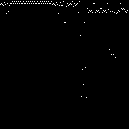

# La_La_Composer 

  

> A Machine Learning composer. 

 

---

### Table of Contents 

These are the sections on the [README.md](https://github.com/Deltasiv/Darwin/blob/master/README.md) file. 

- [Description](#description)
- [How To Use](#how-to-use)
- [References](#references) 
- [Contributing](#contributing) 
- [License](#license)
- [Author Info](#author-info)
- [Contributors](#contributors) 
- [Version Info](#version-info)
- [Help](#help) 
- [Info](#info) 

--- 

## Description 

La_La_Composer is a Machine Learning composer trained with large midi datasets to create its own kind of music. GAN technology is
used to make this possible. The music that comes out of the program will be heavily inspired by the midi data that the program has been given.

The GAN model is being trained on images that have been made out of midi's. In turn the GAN model will make images similar to the images given by the user.
The next plan is to be able to decrypt the images that the GAN will output and turn them into music.

#### Technologies 

- Python 3.6

## How To Use 

Run the program with this command, after downloading all packages
```
python main.py
```

#### Prerequistites 

You must have node installed with the right versions specified in the technologies part.

#### Installation 

Download all packages with
```
pip install tensorflow
pip install keras
pip install pillow
pip install numpy
pip install matplotlib
pip install music21
pip install python-midi
pip install mido
pip install python-rtmidi
```

---

## References 

[Back To The Top](#Darwin) 

--- 

## Contributing

If you wish to help on this project you can simply make changes to the file and post your changes and if they are appreciated we will merge them to the Master branch. Please read the [CONTRIBUTING.md](https://github.com/YELLOWHATT/Darwin/blob/master/CONTRIBUTORS.md) file for more information. If you have contributed to this work known as Darwin you will be credited the file for contributors is [CONTRIBUTIONS.md](https://github.com/YELLOWHATT/Darwin/blob/master/CONTRIBUTIONS.md). :) 

--- 

## License 

MIT License

Copyright (c) 2019 Johannes Leppäkorpi

Permission is hereby granted, free of charge, to any person obtaining a copy
of this software and associated documentation files (the "Software"), to deal
in the Software without restriction, including without limitation the rights
to use, copy, modify, merge, publish, distribute, sublicense, and/or sell
copies of the Software, and to permit persons to whom the Software is
furnished to do so, subject to the following conditions:

The above copyright notice and this permission notice shall be included in all
copies or substantial portions of the Software.

THE SOFTWARE IS PROVIDED "AS IS", WITHOUT WARRANTY OF ANY KIND, EXPRESS OR
IMPLIED, INCLUDING BUT NOT LIMITED TO THE WARRANTIES OF MERCHANTABILITY,
FITNESS FOR A PARTICULAR PURPOSE AND NONINFRINGEMENT. IN NO EVENT SHALL THE
AUTHORS OR COPYRIGHT HOLDERS BE LIABLE FOR ANY CLAIM, DAMAGES OR OTHER
LIABILITY, WHETHER IN AN ACTION OF CONTRACT, TORT OR OTHERWISE, ARISING FROM,
OUT OF OR IN CONNECTION WITH THE SOFTWARE OR THE USE OR OTHER DEALINGS IN THE
SOFTWARE.
 

[Back To The Top](#La_La_Composer) 

--- 

## Author Info 

- Github - [Johk3](https://github.com/Johk3)

--- 

## Contributors 

- Johk3 

--- 

## Version Info 

The current stable version of La_La_Composer is: 1.1.5

* Added ability to create image data from midis
* Integrated image data to the GAN

--- 

## Help 

If there is a bug please contact us through our social media or email. 


- Email Address: johkmr@gmail.com

- [Discord Link](https://discord.gg/EmUedu)

--- 

## Info 

If you have any info you are willing to know contact us on our social media or email. 

Emails are located in [Help](#help) ortherwise use Twitter or Discord.  

--- 

#### Thank you for giving La_La_Composer a look :) 

---

[Back To The Top](#Darwin) 
